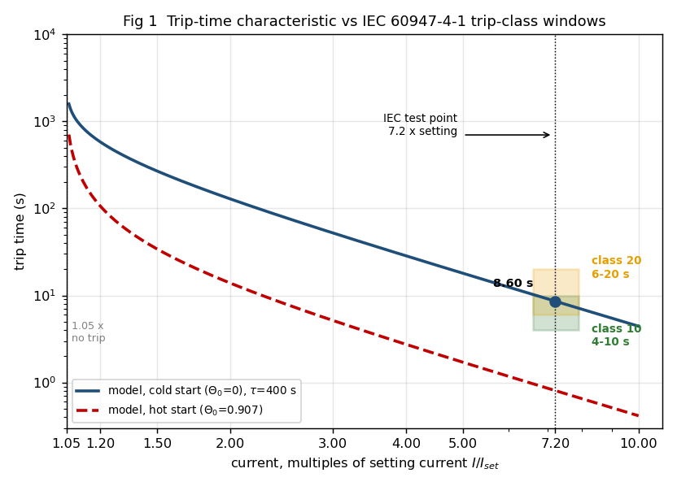
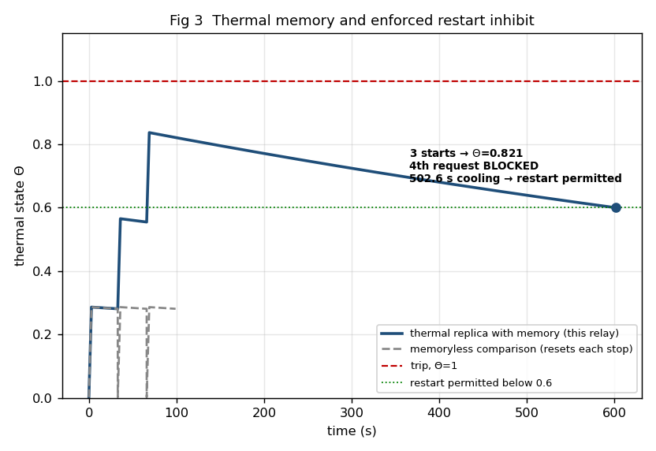

<div align="center">

# Digital Motor Protection Relay

**A simulation study for reliable and smart motor protection**

[Project repository](https://github.com/Agrawaladarsh524/Digital_motor_protection_relay) | [Run locally](#run-locally) | [View results](#results)

   

</div>

> A software-only project. The motor parameters are representative values for a low-voltage induction motor and were not measured from hardware.

## Project snapshot

When heavy industrial motors start, they naturally draw a massive amount of current. However, if this current stays too high for too long, or if the power supply becomes unbalanced, the motor can overheat and suffer catastrophic damage.

A simple fuse or basic threshold isn't enough because a healthy motor actually needs high currents just to get going. This project models a **"Smart" Digital Protection Relay** that mathematically tracks the thermal stress (heat) inside the motor over time. It accurately prevents dangerous conditions like stalling, phase-loss, and repeated dangerous startups without falsely tripping during a normal start.

The relay is verified against standard fault scenarios:

| Measure | Target | Result |
| :--- | :--- | :--- |
| **Trip Time (7.2x overload)** | `<= 10 s` | **8.60 s** |
| **Thermal Memory Block** | `< 4 starts` | **Blocks 4th start** |
| **Phase-loss Sensitivity** | `<= 90 s` | **82.0 s** |
| **Numerical Error** | `<= 1.0%` | **0.124%** |

Selected relay parameters:

```text
tau = 400 s     k_ult = 1.05     K = 6
```

The maximum thermal limit prevents catastrophic failure. The selected time constant (`tau = 400 s`) provides a fast and reliable trip time (`8.60 s`) that sits perfectly within the required Class 10 protection band.

## Results

### 1. The Trip Curve
This graph shows how quickly the relay trips based on the current level. Extremely high currents cause a fast trip (seconds), while lower overloads allow the motor to run longer before tripping.

<div align="center">
  
</div>

### 2. Thermal Memory & Restart Inhibit
This is a critical safety feature. When a motor is started multiple times in a row, the heat builds up. The relay tracks this "thermal state." If the motor gets too hot (Theta approaches 1.0), the relay completely blocks any further restarts until the motor has safely cooled down.

<div align="center">
  
</div>

## Run locally

It is incredibly easy to run this simulation yourself. You will need Python 3 installed.

**1. Install Dependencies**
```bash
pip install -r requirements.txt
```

**2. Run the Core Simulation**
This will execute the protection logic and output the results for different fault scenarios.
```bash
python motor_relay.py
```

**3. Generate the Graphs**
This script will produce all the visual plots.
```bash
python make_plots.py
```
